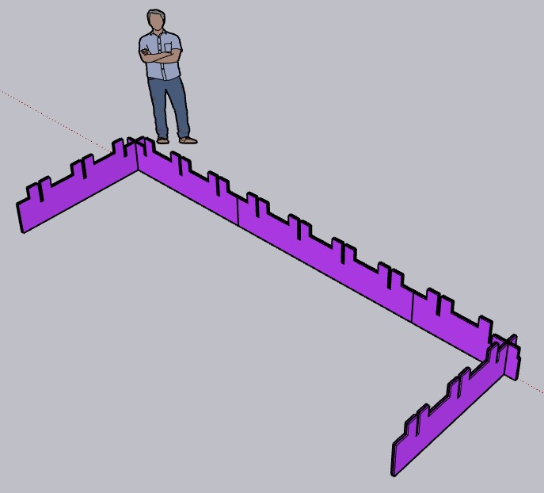
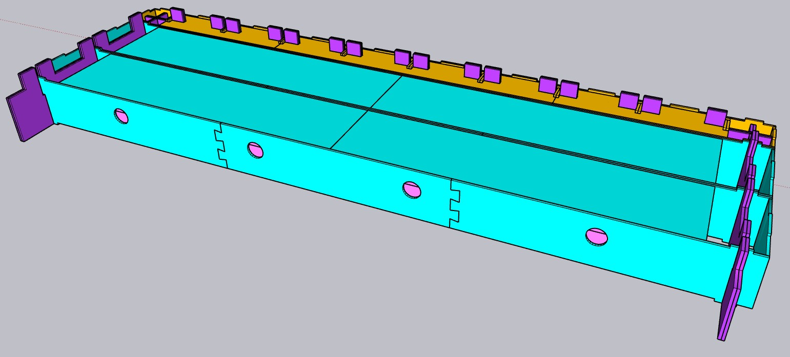
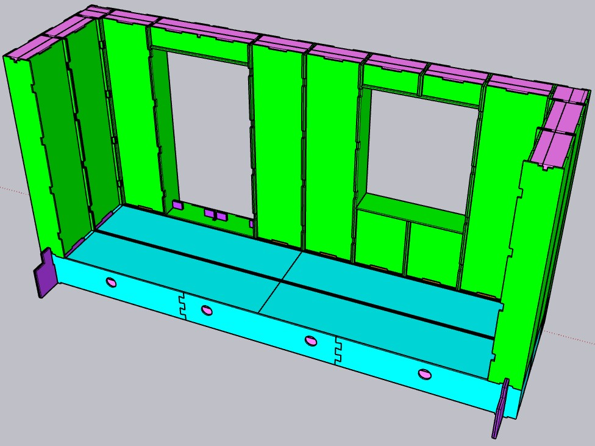
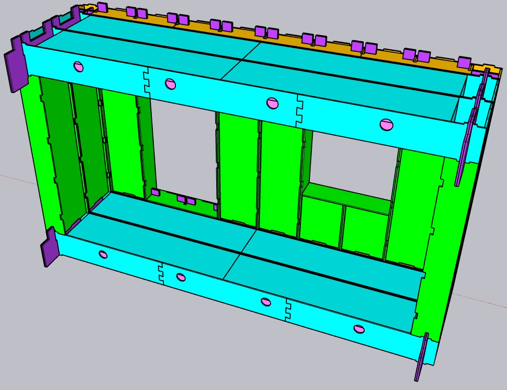

Building The London WikiHouse Skylark Model In SketchUp
=======================================================

We rebuilt the Skylark Model that was on display in London earlier this month (February 2022). It's important to keep in mind that the WikiHouse team is still working on the general design guide and this is expected to be published soon (according to their updates on the WikiHouse-Contributers Slack channel). So the way that we have modelled the model may not be 100% the correct way of using the Skylark design, but we tried to make the design as structurally sound as possible (though we are not architects).

Understanding the Skylark blocks
--------------------------------
This was the first step I started with last week and definitely is the most important part to knowing how to use Skylark. The blocks come in different sizes, for the different axis, and for different purposes. Here's my interpretation of the [Skylark blocks](https://www.wikihouse.cc/blocks) --- note that no blocks are yet available to create stairs:

*1) Windows and doorways*

The easiest blocks to use. The only thing to note is that they come in different sizes and therefore have different measurements in height: Small, Medium, Extra Large.

*2) Walls*

These come in different sizes (S, M, XL) as well as two different types: a corner post and basic wall blocks. The corner posts are for the corners of your house, and they only fit on top of the 'end floor block' as described below. The basic wall blocks are used for all other walls, and they fit best placed sideways on top of the 'floor beam' as described below.

The sizes, like with the windows and doorways, influence the height of the walls, but also the width (to determine whether it is a corner post or to fit them in as wider wall blocks at the side of your house).

*3) Floors*

Similar to the wall blocks, these come in different sizes (S, M, L) as well as two different types: an end floor block and basic floor beams.

The end floor blocks are used to create the outer frame of your building where the ground level x-axis combs, as described below, will need to slide into the openings. The basic floor beams are the floors across the rest of the house.

The sizes influence the width of the blocks (and therefore the width of your building) and have a different length (i.e. depth) to them depending on whether it is an end floor block or floor beams (this will influence whether a wall corner post or a wall block will fit on top of them, as described above).

*4) Other (combs)*

These are the most complicated blocks to figure out but once you've broken it down, it actually makes sense. The combs come in different sizes, axis, types, and for different purposes.

The sizes are indicated with the numbers 1 (small), 2 (medium), and 3 (long). This influences the width of the combs.

The axis (X or Y) will determine whether you use the combs for the front of your building (x-axis) or the side of your building (y-axis).

The types (end or mid-section) will determine the order in which you use the combs. Each corner of the house needs to start/end with an 'end' comb and everywhere in between you can use the 'mid-section' comb.

The purpose of the combs are either ground level or mid-level, and will be influenced by the level of the building you are working on. You start the foundation of your building with a ground level comb, and every level you build above that are supported by mid-level combs. The mid-level combs are higher in size than the ground level combs. Ground level combs are indicated with an A in the title of the comb. Mid-level combs are indicated with a B in the title.

*5) Roof*

It has been mentioned on the WikiHouse-Contributers Slack forum that floor blocks can be used to create a flat roof, which is exactly what the Skylark Model we recreated does too.

In addition, there are also two roof blocks. One is listed under 'roofs' on the WikiHouse blocks page and it seems to work in a similar way as the 'end floor' block: you will need to use the 'roof level' comb first to provide the structure, and then slide the roof block on top. I haven't practiced with this yet.

Designing the Skylark Model
---------------------------

To recreate the Skylark Model that was on display in London earlier this month, we used a lot of trial and error but also used the [YouTube video of the build](https://youtu.be/r5O5D2iEngY) and the written documentation that was available in the Design Centre in London as reference.

### Create the floor frame

The floor frame is created by combining different combs. You will need to create an X-axis and a Y-axis. The corners of the X-axis and the Y-axis slide into one another, as pictured below:

*Note the 'peaks' on the combs which is where the other building blocks slide on top of.*

To make sure your foundations and the frame generally is strong, you need to be mindful of three things:

1.  Know your intended width of the building. We wanted to use the M-sized blocks later on so we had to create a combs frame that would work with the M-sized end floor block. We used this to check the length of the combs frame that we were creating. It meant 7 sets of 'peaks' and two single 'peaks' at each end of the frame for the x-axis.
2.  On each axis, use two rows of combs that are positioned right next to another, face to face --- this means that for the x-axis when you slide a floor block on top, there are two double peaks that neatly fit into the cut out rectangles. Always make sure that the 'peaks' of the combs align on each axis.
3.  The second row that you model needs to be **reversed** from the first row, so that the end lines of the individual combs pieces do not form one single point (because that would make the structure weak).

We have modelled the x-axis as:

*First row:*

-   COMB A END X1
-   COMB A MID 1
-   COMB A END X2

*Second row (aligned right next to the first row, face-to-face):*

-   COMB A END X3
-   COMB A MID 1
-   COMB A END X2

Then we modelled the y-axis with two times COMB A END Y2 face-to-face (same direction, not reversed as the frame of the Y-axis is only one comb long in this particular model). Note that in a real house you would need to make the Y-axis longer to create the full depth of the house, for which the above notes apply.

### Create the floor

Once you have created the frame, you can slide the floor blocks on top of the frame.

You will need to start with the 'end floor' block on the x-axis with the correct size that you are modelling with (M in our case). If you've done everything correctly, the 'peaks' of the x-axis combs will fit neatly through the rectangular holes on top of the end floor block.

Then you can add the floor beams in the middle of the structure. The two 'peaks' of the y-axis floor frame will fit neatly inside each end of the floor beam.

### Create the walls incl. door and window

With the floor in place, you can start adding in the walls, door and window frames.

You start with the two corners of the model, where you will need to put a basic corner post in the right size (M). You will need to change the orientation of the block to ensure that the holes at the bottom slide neatly on top of the small blocks on the face of the end floor block.

Then, on the y-axis, you add two basic wall blocks in the correct size (M) on top of each of the floor beams. Note that you again will need to change the orientation of the wall block; the inside of the wall is indicated with small equal cut outs on the inner edges.

Finally on to the x-axis where you add a basic wall block in the correct size (M) right next to each of the corner posts. Then on the left side of the x-axis, you can add a basic door block (size M) in the same way as adding a wall (so it slides on top of the 'peaks' sticking out from the end floor block). Add two more basic wall blocks next to the door, and then add a basic window block (size M) in similar fashion. Your model will now look like this:

### Create the flat roof frame

Before you can add a roof to the building, you will need to create a roof frame with the mid-level combs. You can use the exact same process as you did for the floor frame, but this time with the mid-level combs instead of the ground level combs, which in our case looked like this:

*X-axis first row:*

-   COMB B END X1
-   COMB B MID 1
-   COMB B END X2

*Second row (aligned right next to the first row, face-to-face):*

-   COMB B END X2
-   COMB B MID 1
-   COMB B END X1

Then we modelled the y-axis with two times COMB B END Y2 face-to-face (same direction, not reversed as the frame of the Y-axis is only one comb long in this particular model).

### Create the roof

Finally, you repeat the steps of adding the floor, but this time on top of the walls. That means adding an end floor block on the outer x-axis first, and then two floor beams in the middle. Your model will now look like this:

End notes
---------

We modelled with the simple blocks design kit which gives less detail of how the blocks would look in real life than the full design kit.

We also noticed that there is a slight off-set between the basic wall blocks and the floor beams; we're not sure whether this is on purpose to allow for the CNC cutting or an error in the design of the simple blocks (we also haven't modelled yet with the full detail design kit so can't compare!). In any case, we aligned all blocks with the corners which means that between the floor/walls in the middle there is a slight offset. However, everything is still poka yoke so we do think we have modelled correctly.
