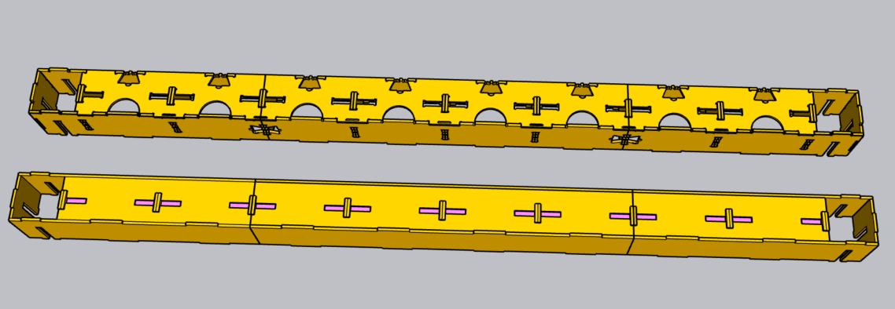
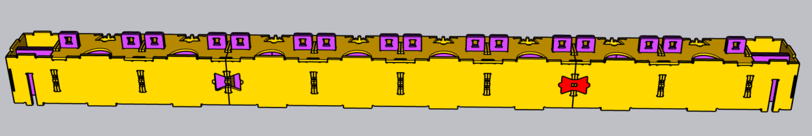
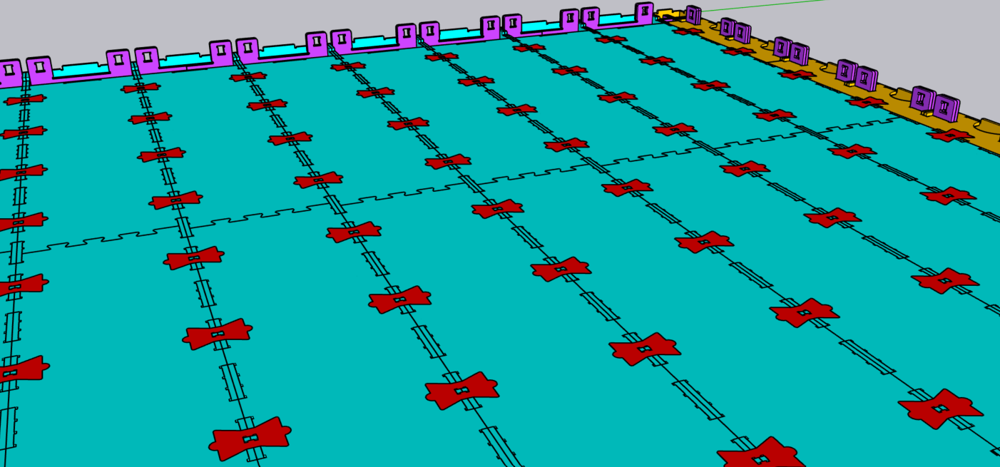
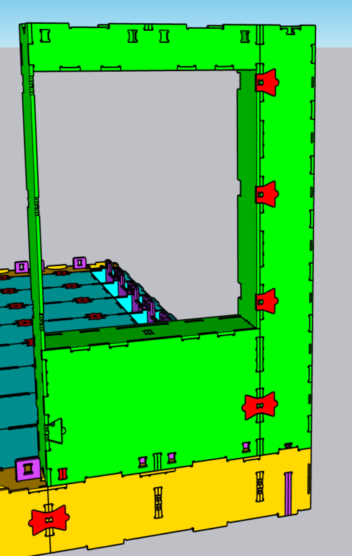
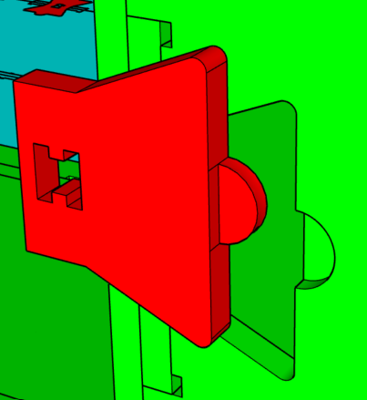
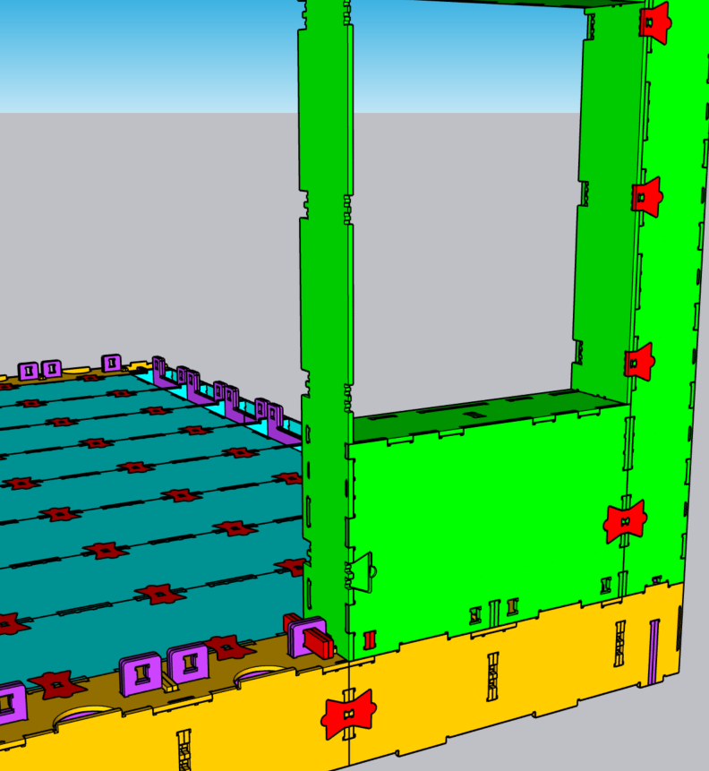

Practicing With The Detailed Design Kit: Pegs and Ties
=======================================================

For the past one-and-a-half months I have been practicing with WikiHouse Skylark and I am pretty convinced that one day we will build our own home using this system. Before then though, I need to make sure that I fully understand how to build with it. 

I moved from building with the simple design kit to the detailed blocks. I knew that the one thing I was still missing in my practice designs were the pegs and ties. But I did not fully appreciate how important they are in fitting all the blocks together and making your design structurally sound. Although I am not an engineer, I can fully appreciate the details and the thought that has gone in to designing Skylark and making sure that all the blocks are not just a puzzle that you put together, but it is a build that is connected in more ways than one.

Here are the things I learned with my practice of the ‘detailed’ design blocks.

### 1. It is easier to understand how the blocks are manufactured and fit together.

The one thing that struck me immediately was how easy it was to tell what way you fit the end floor blocks for the x-axis; no longer do I need to guess which way around the block fits, but the markings on the block that indicate where connecting pieces need to go makes this much easier (the half circles are the outside edge; the half ties the inside).

The above is a comparison of the medium-sized end floor blocks. Top is the detailed block with markings. Bottom is the simple design block.

The markings on the blocks also make it easier how the Skylark blocks are manufactured. WikiHouse is designed to be build with plywood, for which the blocks need to be cut with a CNC machine. 
That means you will receive flat pieces of wood that you need to assemble yourself into the correct blocks, before you can actually put the blocks together on site and create your home.

For the floor end blocks, that means you are actually creating three rectangular boxes first, which are then fitted together to create the longer x-axis end floor block. 
While you can see this clearly in both the simple and detailed blocks, in the simple design block it is not yet clear how these individual blocks are joined together, other than potentially the combs that fit under them. 
With the detailed block, however, you see that in addition to the combs on which you fit the floor, there are butterfly-shaped ties that keep the individual blocks together:

The above is an example of the markings which indicate how the individual blocks are joined together to create the full end floor block. On the left you see the butterfly-shaped tie cut out where the connection is supposed to fit. On the right the connection has been fitted. The floor blocks are connected by ties as well as the foundation of combs.

### 2. The ties connect your blocks and make your floors and walls into one joined-up piece.

The butterfly-shaped ties play a crucial role in connecting all the different blocks. By using the full ties you can connect two individual blocks and create a joined up floor.

The above is an example of the details in the floor of WikiHouse Skylark. The ties hold the floor beams together.

In addition to the full ties that connect two blocks together, there are also half ties which you need to use to connect a block that has an opening, such as a window or door block, with the wall block located next to them:

The above is an example of how the window block uses both full ties and half ties to connect the block to the end wall on the right. At the bottom, the full tie can be used, whereas at the window opening at the top, you need to use half ties to connect the two blocks together.

You do need to make sure, however, that the ties are fitted in the right way. There are shapes cut out into the Skylark blocks where the ties need to neatly fit in:

The above is an example of the wrong way of fitting a half tie. The curving on the right side of the tie would not fall neatly into the cut out shape of the block (in green) when inserted this way.

Below is an example of fitting a half tie correctly. The curving on the right side of the tie will now fall neatly into the cut out shape of the block (in green).

 
### 3. The pegs connect your walls with your floors.

The final bit I learned while practicing with the ties and pegs to join all the detailed blocks together, was the ingenuity about how to use pegs to make all the joining of the blocks come together. 
With the ties, you connect your floors and your walls into one joined-up piece. Makes sense.

But how to make sure that your walls are joined with your floors? 

Previously I thought, ah well the top of the combs fit neatly inside the bottom of your wall blocks and there is a small cut out rectangular where the endges of the wall join with the edges of the floors. Basically I gave all credits to the combs.

Now I know, however, that it is the humble, unforeseen peg that really should be celebrated. 

What you need to do is to line up two small pegs and fit them through the small corner holes of the walls and into the cut out holes on top of the combs. 
This way the walls (whether that is a regular wall, window or door block) are connect with the floor through the combs. You will need to do this at the bottom (to connect the wall to the floor) and the top (to connect the wall to the ceiling or second floor of your house).

The above is an example of how to pegs fit through the corner of the wall blocks and through the tops of the combs, joining the walls and floors together. From left to right: top of combs without pegs, top of comb with pegs inserted, pegs inserted through the corner of a wall block and through the top of the comb (not visible in the illustration as this is inside the bottom of the wall).

The only thing left to consider, for now, is how to insert the pegs in the right way. One side of them has a rounded curve, and the other side has a straight edge. 

I initially fitted them with the straight edge on the outside of the house, but the example chassis that the WikiHouse team uploaded online has it the other way around. I can’t figure out yet what the right way is, but one thing is sure: use the curved side first to insert the pegs or they won't fit.